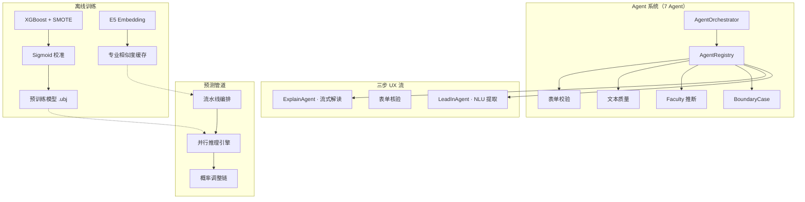

# Signals &middot; 留学择校系统

> 基于 XGBoost + 7 Agent LLM 管线的录取预测平台 — 从离线训练到 Web 交互，一人全栈。


**在线**：Streamlit（80 端口）&ensp;|&ensp; **认证**：E2 OAuth &ensp;|&ensp; **用户**：~500 账号，日活 85-110 &ensp;|&ensp; **覆盖**：销售 400 + 规划师 220 + 管理层 80

---

## 功能亮点

- **录取概率预测** — XGBoost 二分类 + sigmoid 校准，叠加 TF-IDF 文本信号增强 + 专业相似度匹配 + 可配置规则引擎
- **LLM Agent 全链路** — 7 Agent 覆盖前期 NLU → 中期预测 → 后期解读，自研三层架构（Context → Registry → Orchestrator），不依赖 LangChain
- **并发推理引擎** — 进程池/线程池切换、超时控制、自动分块，8 并发下吞吐量仅衰减 15%
- **工业级 UI** — 6 层 CSS 设计系统（玻璃态/金属 Logo/辉光动画/噪点纹理），三步 UX 流

---

## 使用情况

系统已在内部全国范围落地。工作日日活 85-110 人，中期规划师是最高频用户（客均日调用 3-5 次），累计开通率约 72%。

---

## 系统架构



**在线路径**：顾问自由文本 → LeadInAgent NLU 提取 → 表单自动填充 → 预测管道（特征构建 → 并行 XGBoost → 概率调整链）→ ExplainAgent 流式解读

**概率调整链**：GPA/语言惩罚 → 跨专业惩罚(×0.5) → 跨学院惩罚(×0.3) → 职业学位降级 → TF-IDF 文本提升

---

## Agent 系统

### 设计理念

固定流程的 LLM 应用中，LangChain 的 Chain/Tool 抽象带来的复杂度远超收益。本系统直接从 `BaseAgent` 继承，每个 Agent 实现 `run(context, **kwargs) → dict`，通过 `AgentOrchestrator` 统一调用。

### 三层架构

```
AgentOrchestrator  →  路由 + 审计追踪
AgentRegistry      →  懒注册 dict wrapper
BaseAgent          →  client / 双层缓存 / 重试 / 三级JSON容错
```

### 核心能力

| 能力 | 实现 |
|------|------|
| 多轮 NLU | `conversation_turns` 追踪对话，`_merge_extracted_background` 增量合并 |
| 三级 JSON 容错 | direct parse → lightweight regex(<1ms) → API repair(~9s) |
| 流式输出 | SSE streaming，配合 `st.write_stream` 实时展示 |
| 双层缓存 | 内存 LRU(1000) + 文件 JSON，按 prompt hash 去重 |
| 结构化日志 | `[Agent名] REQ START/OK/TIMEOUT` 含 token 估算、延迟、重试 |

### Agent 清单

| Agent | 阶段 | 延迟 | 作用 |
|-------|------|------|------|
| `LeadInAgent` | 前期 | ~5s | 自由文本 → 结构化背景 + 评估 + 追问（多轮增量） |
| `ExplainAgent` | 后期 | ~12s | 预测结果 → 流式自然语言解读（优势/风险/推荐） |
| `BoundaryCaseAgent` | 中期 | ~2s | 相似/跨专业推荐边界决策 |
| `BackgroundFacultyAgent` | 中期 | ~1.5s | 专业 → 学部推断 |
| `TextPreprocessingAgent` | 中期 | ~2s | 经历文本质量评估 |
| `FormValidationAgent` | 前期 | <1ms | 规则 + LLM 两层表单校验 |

---

## 部署与性能

### 生产环境

腾讯云单 Pod（4C2G），Streamlit 一体化部署。日活 ~100 人非集中并发下完全够用。

仓库含 `src/pages/prediction/api/json_api.py` 作为前后端解耦预研：完整预测链路封装为无状态函数，后续可拆分 Streamlit + FastAPI 推理服务独立部署。

### 压测基准

推理引擎端到端并发测试（`tests/stress/test_prediction_stability.py`）：

| 并发 | 请求数 | 吞吐量(RPS) | 平均延迟 | CPU | 内存 |
|------|--------|------------|----------|-----|------|
| 2 | 10 | 31.5 | 60ms | 98.6% | 540MB |
| 4 | 20 | 29.4 | 127ms | — | — |
| 8 | 30 | 27.1 | 262ms | — | — |

吞吐量从 2→8 并发仅衰减 15%，瓶颈在 CPU 非内存。单请求延迟在 8 并发下 262ms 仍可交互。

### 推理引擎参数

| 环境变量 | 默认值 | 说明 |
|----------|--------|------|
| `PREDICTION_SINGLE_THREAD_THRESHOLD` | 2048 | 低于此任务数走单线程 |
| `PREDICTION_MIN_CHUNK_SIZE` | 256 | 并发 worker 最小分块 |
| `PREDICTION_USE_PROCESS_POOL` | 0 | 设为 1 启用进程池（绕过 GIL） |
| `PREDICTION_OVERALL_TIMEOUT_SEC` | 300 | 整体超时 |

---

## 技术栈

- **Web**: Streamlit, streamlit-aggrid, streamlit-echarts
- **ML**: XGBoost, scikit-learn, NumPy, pandas
- **LLM**: DeepSeek v3.2 (OpenAI 兼容 API)
- **加速**: numba (JIT), rapidfuzz (模糊匹配), 多进程推理
- **质量**: Ruff, Black, Mypy, pytest

---

## 项目结构

```
├── main.py                             应用入口
├── pages/hk.py                         预测页面（薄路由）
├── config/                             JSON 配置中心
│   ├── app_config.json                 OAuth / API 密钥
│   ├── auth_config.json               权限白名单（~500人）
│   ├── prediction_rules.json          院校排序 / 展示规则
│   └── *.example.json                 配置模板
├── src/
│   ├── agent/                          Agent 系统
│   │   ├── base_agent.py              基类（client/缓存/重试/JSON修复）
│   │   ├── context.py                 StudentContext 共享上下文
│   │   ├── orchestrator.py            编排器
│   │   ├── registry.py                注册中心
│   │   ├── lead_in_agent.py           前期 NLU
│   │   ├── explain_agent.py           结果解读（流式）
│   │   ├── form_validation_agent.py   表单校验
│   │   └── *_agent.py                 边界 / 学部 / 文本
│   ├── pages/prediction/              预测子系统
│   │   ├── flow/pipeline.py           编排管线
│   │   ├── prediction_execution/      推理引擎
│   │   ├── result_modifier/           概率调整链
│   │   ├── result_display/            结果展示
│   │   ├── input_form_components/     表单校验与归一化
│   │   └── api/json_api.py            进程内 API（解耦预研）
│   ├── machine_learning_models/       离线训练
│   └── utils/                         认证 / 日志 / 数据加载
├── assets/hk_style/                   CSS 设计系统（6 层）
├── scripts/                           相似度预计算 / TF-IDF 训练
├── tests/                             单元 / 集成 / 压测
└── docs/                              模块 API 文档
```

---

## 设计决策

| 决策 | 理由 |
|------|------|
| 不依赖 LangChain | 固定流程不需要 Chain/Tool 抽象，直接继承更简洁 |
| DeepSeek v3.2 而非 GPT-4 | 成本低 10×，中文 NLU 相当，OpenAI 兼容 API |
| XGBoost 而非深度学习 | 6 万样本下树模型更稳健，单调约束保证业务合理性 |
| Streamlit 而非 React | 内部工具快速迭代，CSS 设计系统弥补 UI 局限 |
| 概率等级制而非精确 % | 6 万样本不足以支撑精确概率，分级更诚实更安全 |
| `.feather` + `st.cache` 而非 DB | 无运维负担，数据量级适合内存缓存 |

---

## 快速开始

```bash
pip install -r requirements.txt

# 准备配置
cp config/app_config.example.json config/app_config.json
cp config/auth_config.example.json config/auth_config.json

streamlit run main.py
```

开发环境在 `config/dev_config.json` 设 `DEBUG_MODE: true` 跳过 OAuth。

---

## 相关文档

- [预测 API](docs/prediction_api.md) · [表单组件](docs/input_form_components_api.md) · [结果后处理](docs/result_modifier_api.md)
- [训练 API](docs/ml_training_api.md) · [相似度预计算](docs/major_similarity_precompute.md)
- [预测子系统](src/pages/prediction/README.md) · [Agent 系统](src/agent/README.md)

---

## License

MIT

---

> **作者**：Jiapeng Li &ensp;|&ensp; [lijiapeng8@xdf.cn](mailto:lijiapeng8@xdf.cn)
