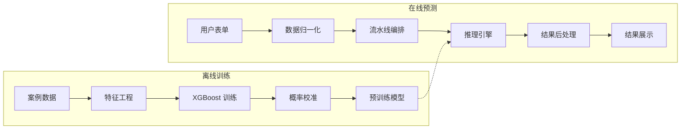
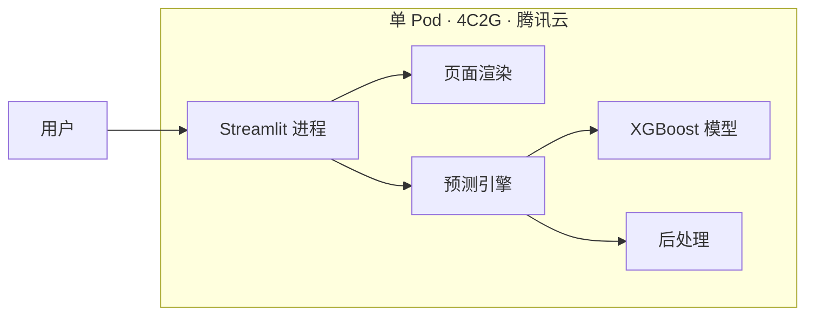

# EasyApply

基于机器学习的留学录取预测平台 — 从 XGBoost 训练到 Streamlit 交互，一人全栈。


## 这个项目做什么

EasyApply 是一个面向留学申请场景的一站式数据产品，围绕留学业务的不同阶段提供支撑：前期销售用它向学生和家长展示数据化的录取分析能力，中期规划师用它辅助院校和专业选择，后期服务团队把它当作院校与专业维度的知识库快速查阅，也具备面向 C 端用户自助查询的潜力。核心能力是录取概率预测——用户输入本科背景、GPA、语言成绩、目标院校等信息，系统给出各专业的录取概率估计，并推荐相似专业和跨专业方向。

技术上，预测链路不只是一个裸模型调用。系统在 XGBoost 二分类的基础上叠加了 TF-IDF 文本信号增强（从申请者背景经历中提取高信号词并转化为 logit uplift）、专业相似度匹配（预计算的专业间语义距离）、以及一套可配置的业务规则引擎（GPA 转换、语言分惩罚、跨专业调整、学部归并等），最终输出经过校准和后处理的概率分布。

整个系统由我个人独立设计、开发和维护，覆盖离线训练、在线推理、Web 交互、权限管理的完整链路。部分内部业务模块（HR 看板、管理后台等）在开源版本中已移除，保留的是预测系统的核心源码与工程架构。

### 使用情况

系统已在内部全国范围落地，覆盖前期销售顾问约 400 人、中期留学规划师约 220 人、后期服务及管理层约 80 人。累计开通账号约 500 个，整体开通率约 72%。工作日日活稳定在 85–110 人，其中中期规划师是最高频的使用群体，客均日调用预测 3–5 次。

## 功能亮点

- **录取概率预测** — XGBoost 二分类 + sigmoid 校准，输出可解释的概率值
- **文本信号增强** — TF-IDF 提取申请背景中的高信号词，转化为 logit uplift 叠加到模型输出
- **专业相似度推荐** — 预计算专业间语义距离，支持相似专业和跨专业方向推荐
- **可配置规则引擎** — GPA 转换规则、语言成绩惩罚、院校排序、跨专业调整等均通过 JSON 配置驱动
- **并发推理引擎** — 支持进程池/线程池切换、超时控制、自动分块，适应不同规模的批量预测
- **完整 Web 应用** — 基于 Streamlit 的多页应用，内置 OAuth 认证与模块级权限控制

## 系统架构



在线预测的核心路径：表单校验与归一化（`input_form_components/`）→ 流水线编排与推理（`flow/pipeline.py` → `prediction_execution/executor.py`）→ 结果后处理（`result_modifier/`，含 TF-IDF uplift、GPA/语言惩罚、跨专业规则等）。

离线训练通过 `src/machine_learning_models/train.py` 驱动，产出 XGBoost 模型和校准器，供在线推理加载。

## 部署架构与性能

### 生产环境

当前生产环境运行在腾讯云单 Pod 上（4 核 / 2 GB），采用 Streamlit 一体化架构——UI 渲染和预测推理运行在同一进程内，通过 Streamlit 的 session state 管理用户会话。



这套架构对当前的内部员工规模（日活 ~100 人，非集中并发）完全够用。但因为 Streamlit 的 session state 绑定在进程内存中，无法直接做多 Pod 水平扩展——请求轮转到不同实例会丢失会话上下文。

仓库中 `src/pages/prediction/api/json_api.py` 是为前后端解耦做的预研：它将完整的预测链路封装为无状态的函数调用接口，后续计划包裹为 FastAPI 服务独立部署。解耦后的目标架构是 Streamlit（或无状态前端）+ FastAPI 推理服务分离部署，推理层可独立扩缩容，Streamlit 侧通过 HTTP 调用推理服务，会话状态外置到 Redis 或改用 sticky session。

### 压测基准

仓库内附带阶梯式压测脚本（`tests/stress/test_prediction_stability.py`），对预测流水线做端到端的并发测试，同时采集 CPU 和内存指标。以下是最近一次压测结果：

| 并发数 | 请求总数 | 吞吐量 (RPS) | 平均延迟 |
|--------|----------|-------------|----------|
| 2 | 10 | 31.5 | 60 ms |
| 4 | 20 | 29.4 | 127 ms |
| 8 | 30 | 27.1 | 262 ms |

资源峰值：CPU 98.6%，内存 540 MB。

几个观察：吞吐量在并发从 2 增加到 8 的过程中衰减不到 15%，说明推理引擎的分块和线程池策略在 CPU 密集场景下做到了较好的利用率。内存全程控制在 540 MB 以内（2 GB 上限的 27%），瓶颈明确在 CPU 而非内存。单请求延迟在 8 并发下仍在 262 ms，对于交互式场景完全可接受。

推理引擎（`prediction_execution/executor.py`）的并发行为可通过环境变量调整：

| 环境变量 | 默认值 | 说明 |
|----------|--------|------|
| `PREDICTION_SINGLE_THREAD_THRESHOLD` | 2048 | 低于此任务数时走单线程，避免调度开销 |
| `PREDICTION_MIN_CHUNK_SIZE` | 256 | 并发时每个 worker 的最小分块大小 |
| `PREDICTION_USE_PROCESS_POOL` | 0 | 设为 1 启用进程池（绕过 GIL，适合纯 CPU 密集） |
| `PREDICTION_OVERALL_TIMEOUT_SEC` | 300 | 整体超时秒数 |

## 技术栈

- **Web 框架**: Streamlit, streamlit-aggrid, streamlit-echarts
- **机器学习**: XGBoost, scikit-learn, NumPy, pandas
- **性能优化**: numba (JIT 编译), rapidfuzz (模糊匹配), 多进程/多线程推理
- **代码质量**: Ruff, Black, Mypy, pytest, pre-commit

## 快速开始

**1. 创建虚拟环境并安装依赖**

```bash
python -m venv .venv

# Windows PowerShell
.venv\Scripts\Activate.ps1

# Linux / macOS
source .venv/bin/activate

pip install -r requirements.txt
```

**2. 准备配置文件**

将 `config/` 下的 `.example.json` 文件复制为对应的 `.json` 文件，并按需填写：

```bash
cp config/app_config.example.json config/app_config.json
cp config/auth_config.example.json config/auth_config.json
cp config/dev_config.example.json config/dev_config.json
```

开发环境下，可在 `config/dev_config.json` 中启用 `DEBUG_MODE` 跳过 OAuth 认证。

**3. 准备数据文件**

系统运行需要案例数据（Feather 格式）和预训练模型文件。数据文件不包含在仓库中，具体路径和格式参见 `src/utils/app_data_loader.py` 和 `src/machine_learning_models/data_config.py`。

**4. 启动应用**

```bash
streamlit run main.py
```

## 项目结构

```
├── main.py                          应用入口与门户页
├── requirements.txt                 运行时依赖
├── pyproject.toml                   Ruff / Black / Mypy / pytest 配置
│
├── config/                          JSON 配置文件
│   ├── app_config.json              应用与 OAuth 配置
│   ├── auth_config.json             用户权限白名单
│   ├── prediction_rules.json        预测业务规则（院校排序、展示逻辑等）
│   ├── gpa_conversion_rules.json    GPA 转换规则
│   ├── similarity_adjustment_rules.json  相似度调整规则
│   └── *.example.json               配置模板
│
├── pages/                           Streamlit 页面路由（薄层，调用 src/pages/）
│
├── src/
│   ├── pages/
│   │   └── prediction/              预测系统核心
│   │       ├── input_form_components/    表单校验与归一化
│   │       ├── flow/                     流水线编排
│   │       ├── prediction_execution/     推理引擎（并发、超时、分块）
│   │       ├── result_modifier/          结果后处理（TF-IDF uplift 等）
│   │       ├── result_display/           结果展示组件
│   │       └── api/                      进程内 JSON API（实验性）
│   │
│   ├── utils/                       认证、数据加载、通用 UI
│   ├── machine_learning_models/     离线训练、特征配置、数据定义
│   └── agent/                       LLM Agent 辅助逻辑
│
├── scripts/                         离线脚本（相似度预计算、TF-IDF 训练等）
├── tests/                           测试（单元 / 集成 / 压力 / 数据质量）
├── docs/                            模块文档
└── assets/                          CSS、图片等静态资源
```

## 配置说明

所有配置文件位于 `config/` 目录，仓库中以 `.example.json` 形式提供模板，复制后按需填写。核心配置文件包括：

| 文件 | 用途 |
|------|------|
| `app_config.json` | OAuth 端点、API 密钥等应用级配置 |
| `auth_config.json` | 用户白名单、模块权限、维护模式开关 |
| `dev_config.json` | 开发调试（DEBUG_MODE、模拟用户） |
| `prediction_rules.json` | 预测业务规则（院校优先级、展示顺序等） |
| `gpa_conversion_rules.json` | 不同 GPA 制式的转换规则 |
| `similarity_adjustment_rules.json` | 专业相似度修正规则 |

敏感配置（API 密钥、OAuth 凭证等）不应提交到版本库。

## 训练自己的模型

训练入口为 `src/machine_learning_models/train.py`，核心训练逻辑在 `model_trainer.py` 中实现。

训练流程概览：

1. 准备 Feather 格式的案例数据，目标列为 `admitted`（二分类：录取/未录取）
2. 在 `data_config.py` 中配置特征列（分类特征、数值特征、文本特征等）
3. 运行训练脚本，产出 XGBoost 模型 + sigmoid 校准器 + 特征名列表
4. 将模型产物放到在线推理的加载路径下

特征定义、采样策略、阈值扫描等细节以代码为准，详见 [训练 API 文档](docs/ml_training_api.md)。

## 测试

```bash
pip install pytest
pytest tests
```

## 文档

预测系统：

- [预测 API](docs/prediction_api.md)
- [表单组件](docs/input_form_components_api.md)
- [结果后处理](docs/result_modifier_api.md)
- [文本增强](docs/text_uplift_api.md)

训练与数据：

- [训练 API](docs/ml_training_api.md)
- [专业相似度预计算](docs/major_similarity_precompute.md)

源码内文档（与上述互补）：

- [预测子系统总览](src/pages/prediction/README.md)
- [流水线编排](src/pages/prediction/flow/README.md)
- [结果修正器](src/pages/prediction/result_modifier/README.md)

## License

本项目基于 [MIT License](LICENSE) 开源。

## 免责声明

本项目由个人独立开发和维护。仓库内所有业务数据、统计样例和示例配置均已脱敏，不包含真实用户的可识别信息。

本软件按现状（AS IS）提供，不作任何明示或默示担保。因使用或无法使用本软件而产生的任何损害，维护人不承担责任。使用者若在自有环境中加载真实数据，须自行满足数据保护与合规要求。
